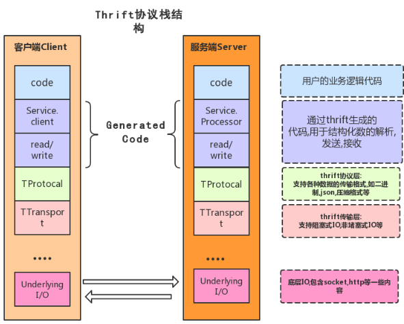
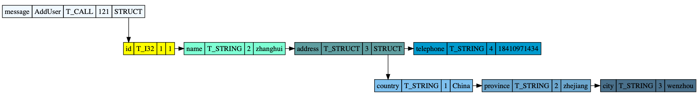
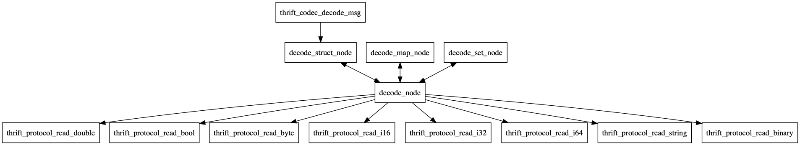
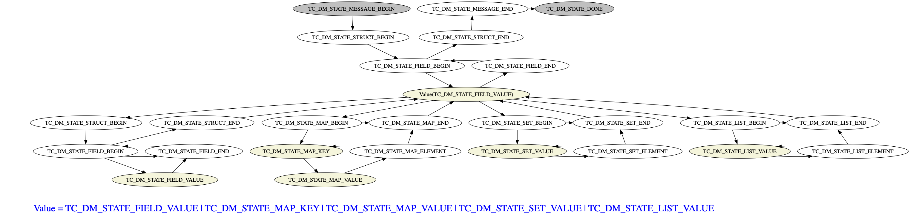
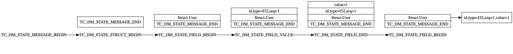
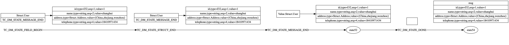
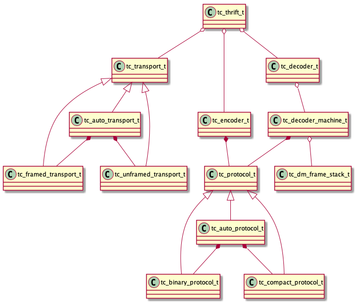

# 通用 thrift 协议编解码器的设计与实现

## 概述

thrift 是一款开源的跨语言 RPC 实现。它通过提供一个代码生成引擎和各个语言的运行时库，让开发者可以快速高效地构建跨语言的分布式服务。

我们希望实现一个通用的 thrift 代理层，因此需要一个非代码生成方式的通用 thrift 协议编解码器。

## 基础知识

thrift 通过一个中间语言 IDL（接口定义语言） 来定义 RPC 的数据类型和接口，然后通过代码生成引擎来生成不同的代码，生成的代码中不但包含目标语言的接口定义、方法、数据类型，还包含有 RPC 协议层和传输层的实现代码。



图1 thrift 协议栈结构

thrift 协议层支持多种序列化协议，最常见的有：

* TBinaryProtocol：一种简单的二进制格式。
* TCompactProtocol：一种更紧凑的二进制格式，相比 TBinaryProtocol，优化了空间。

支持的传输层协议主要有：

* TSocket：使用阻塞的套接字 I/O 来传输数据
* TFramedTransport：按帧传输数据，每一帧的开头是一个4字节的长度信息。

thrift 还支持很多其他协议，但以上是我司的主流使用方式，因此我们的编解码器只支持以上几种协议（TCompactProtocol 还未支持）。

### Thrift Protocol Structure

thrift 协议结构如下所示：
```
      <message> ::= <message-begin> <struct> <message-end>

 <message-begin> ::= <method-name> <message-type> <message-seqid>

   <method-name> ::= STRING

  <message-type> ::= T_CALL | T_REPLY | T_EXCEPTION | T_ONEWAY

 <message-seqid> ::= I32

        <struct> ::= <struct-begin> <field>* <field-stop> <struct-end>

  <struct-begin> ::= <struct-name>

   <struct-name> ::= STRING

    <field-stop> ::= T_STOP

         <field> ::= <field-begin> <field-data> <field-end>

   <field-begin> ::= <field-name> <field-type> <field-id>

    <field-name> ::= STRING

    <field-type> ::= T_BOOL | T_BYTE | T_I8 | T_I16 | T_I32 | T_I64 | T_DOUBLE
                     | T_STRING | T_BINARY | T_STRUCT | T_MAP | T_SET | T_LIST

      <field-id> ::= I16

    <field-data> ::= I8 | I16 | I32 | I64 | DOUBLE | STRING | BINARY
                     <struct> | <map> | <list> | <set>

           <map> ::= <map-begin> <field-data>* <map-end>

     <map-begin> ::= <map-key-type> <map-value-type> <map-size>

  <map-key-type> ::= <field-type>

<map-value-type> ::= <field-type>

      <map-size> ::= I32

          <list> ::= <list-begin> <field-data>* <list-end>

    <list-begin> ::= <list-elem-type> <list-size>

<list-elem-type> ::= <field-type>

     <list-size> ::= I32

           <set> ::= <set-begin> <field-data>* <set-end>

     <set-begin> ::= <set-elem-type> <set-size>

 <set-elem-type> ::= <field-type>

      <set-size> ::= I32
```

### Thrift Binary protocol encoding

#### 基础类型

* Integer: int8, int16, int32, int64 按大端方式编码
* Binary:

```
Binary protocol, binary data, 4+ bytes:
+--------+--------+--------+--------+--------+...+--------+
| byte length                       | bytes               |
+--------+--------+--------+--------+--------+...+--------+
```

* String: 同 Binary
* Double: 将 8 字节的 double 数据视为 int64，按 int64 方式编码。
* Boolean: true 为1，false 为0，按 int8 方式编码。

#### Message

thrift 的 message 分为**严格写**和**非严格写**两种编码方式，两种方式的区别在于头部的编码方式不同，**严格写**编码如下：

```
Binary protocol Message, strict encoding, 12+ bytes:
+--------+--------+--------+--------+--------+--------+--------+--------+--------+...+--------+--------+--------+--------+--------+
|1vvvvvvv|vvvvvvvv|unused  |00000mmm| name length                       | name                | seq id                            |
+--------+--------+--------+--------+--------+--------+--------+--------+--------+...+--------+--------+--------+--------+--------+
```

**非严格写**编码如下：

```
Binary protocol Message, old encoding, 9+ bytes:
+--------+--------+--------+--------+--------+...+--------+--------+--------+--------+--------+--------+
| name length                       | name                |00000mmm| seq id                            |
+--------+--------+--------+--------+--------+...+--------+--------+--------+--------+--------+--------+
```

* 1vvvvvvvvvvvvvvv: 2字节版本号，最高位为1。
* 00000mmm: 1字节消息类型，当前只用到了低3位。
* name length: 4字节名字长度，按 int32 编码。
* name: 消息名称。
* seq id: 4字节消息序列号，按 int32 编码。

消息类型分为：

* Call: 1
* Reply: 2
* Exception: 3
* Oneway: 4

#### Struct

```
struct ::= ( field-type field-id field-value )* stop-field
```
```
Binary protocol field:
+--------+--------+--------+--------+...+--------+
|tttttttt| field id        | field value         |
+--------+--------+--------+--------+...+--------+

Binary protocol stop field:
+--------+
|00000000|
+--------+
```

* tttttttt: 1字节字段类型，按 int8 编码。
* field id: 2字节字段ID，按 int16 编码。
* field value: 字段值。

字段类型分为：

* BOOL: 2
* BYTE: 3
* DOUBLE: 4
* I16: 6
* I32: 8
* I64: 10
* STRING: 11
* STRUCT: 12
* MAP: 13
* SET: 14
* LIST: 15

#### Map

```
map ::= key-element-type value-element-type size ( key value )*
```
```
Binary protocol map (6+ bytes) and key value pairs:
+--------+--------+--------+--------+--------+--------+--------+...+--------+
|kkkkkkkk|vvvvvvvv| size                              | key value pairs     |
+--------+--------+--------+--------+--------+--------+--------+...+--------+
```

* kkkkkkkk: 1字节 key 类型，按 int8 编码。
* vvvvvvvv: 1字节 value 类型，按 int8 编码。
* size: 4字节 map 大小，按 int32 编码。
* key value pairs: key 和 value。

#### List 和 Set

```
list ::= list-elem-type list-size ( element )*
```
```
Binary protocol list (5+ bytes) and elements:
+--------+--------+--------+--------+--------+--------+...+--------+
|tttttttt| size                              | elements            |
+--------+--------+--------+--------+--------+--------+...+--------+
```

* tttttttt: 1字节 list 元素类型，按 int8 编码。
* size: 4字节 list 大小，按 int32 编码。
* elements： list 元素。

Set 编码方式同 List。

## 解码器设计

不同于原生 thrift 依靠代码生成技术来实现消息的编解码，我们需要在没有消息元数据，即不知道消息的结构的情况下去解码数据。

假设有一个 AddUser 接口
```
struct Address {
	1: string country;
	2: string province;
	3: string city;
}
struct User {
	1: i64 id;
	2: string name;
	3: Address address;
	4: string Telephone;
}
service UserService {
	i32 AddUser(1:User user)
}
```
user 数据如下
```
user := User{
	ID:   1,
	Name: "zhanghui",
	Address: &Address{
		Country:  "China",
		Province: "zhejiang",
		City:     "wenzhou",
	},
	Telephone: "18410971434",
}
```
其编码后的数据如下图所示：


图2 编码后的数据示意图

我们需要解析图2中的数据，并在内存中构造出消息树：



图3 消息树

v1 版本的解码器我们采用递归的方式来解析数据，函数调用关系如下图所示：



图4 v1 版本解码器函数调用关系

v1 版本的实现简单，但要求上层能提供阻塞式的数据读取接口，而 nginx 是采用事件驱动的编程模型，不适合提供这样的接口，所以 v2 版本使用了状态机和运行时栈来保存解码进度，以支持事件驱动编程。



图5 解码器状态机

解码过程中的状态和运行时栈变化：



图6 解码器运行时栈1



图7 解码器运行时栈2

## 代码剖析

### 代码结构

主要代码类图如下：



图8 代码类图

### 数据结构

最核心的数据结构是消息树，定义在`tc_value.h`和`tc_message.h`中
```
typedef struct tc_value_s *tc_value_t;

typedef struct tc_field_s {
	tc_string_t name;
	int8_t type;
	int16_t id;
	tc_value_t value;
	struct tc_field_s *link;
} *tc_field_t;

typedef struct tc_struct_s {
	tc_string_t name;
	tc_field_t head;
	tc_field_t tail;
} *tc_struct_t;

struct tc_map_elem_s {
	tc_value_t key;
	tc_value_t value;
};

typedef struct tc_map_s {
	int8_t key_type;
	int8_t value_type;
	int32_t cap;
	int32_t len;
	struct tc_map_elem_s *elems;
} *tc_map_t;

typedef struct tc_set_s {
	int8_t elem_type;
	int32_t cap;
	int32_t len;
	tc_value_t *elems;
} *tc_set_t;

typedef tc_set_t tc_list_t; // list 的数据结构和 set 是一样的

struct tc_value_s {
	int8_t type;
	union {
		bool_t b;
		int8_t i8;
		int16_t i16;
		int32_t i32;
		int64_t i64;
		double d;
		tc_string_t str;
		tc_binary_t bin;
		tc_struct_t st;
		tc_map_t map;
		tc_set_t set;
		tc_list_t list;
	} u;
};

typedef struct tc_message_s {
	tc_string_t method;
	int8_t msg_type;
	int32_t seq_id;
	tc_value_t struct_value;
} *tc_message_t;
```

### 接口介绍

核心接口定义在`tc_thrift.h`文件中
```
tc_error_t tc_thrift_init(tc_context_t ctx, tc_thrift_t t, tc_transport_kind_t tk, tc_protocol_kind_t pk);
tc_error_t tc_thrift_fini(tc_context_t ctx, tc_thrift_t t);
tc_error_t tc_thrift_decode(tc_context_t ctx, tc_thrift_t t, tc_buffer_t buf, tc_message_t *msg);
tc_error_t tc_thrift_encode(tc_context_t ctx, tc_thrift_t t, tc_buffer_t buf, tc_message_t msg);
```

使用方式可参考`tc_thrift_test.c`文件

### 内部实现

#### 基础组件

* context
* string
* binary
* buffer

#### 协议组件

* transport
 * framed transport
 * unframed transport
 * auto transport
* protocol
 * binary protocol
 * auto protocol

#### 核心组件

* value
* message
* encoder
* decoder

#### 接口组件

* thrift
* wrap

## TODO

实现对`tc_value`的简化操作

```
tc_error tc_value_get_i8(tc_context_t ctx, tc_value_t p, const char *key, int8_t *value);
tc_error tc_value_set_i8(tc_context_t ctx, tc_value_t p, const char *key, int8_t value);
...
```
上层通过传入`key=1:2:k1`这种方式来获取或设置值。

## 参考

1. [Thrift Protocol Structure](https://github.com/apache/thrift/blob/master/doc/specs/thrift-protocol-spec.md)
2. [Thrift Binary protocol encoding](https://github.com/apache/thrift/blob/master/doc/specs/thrift-binary-protocol.md)

