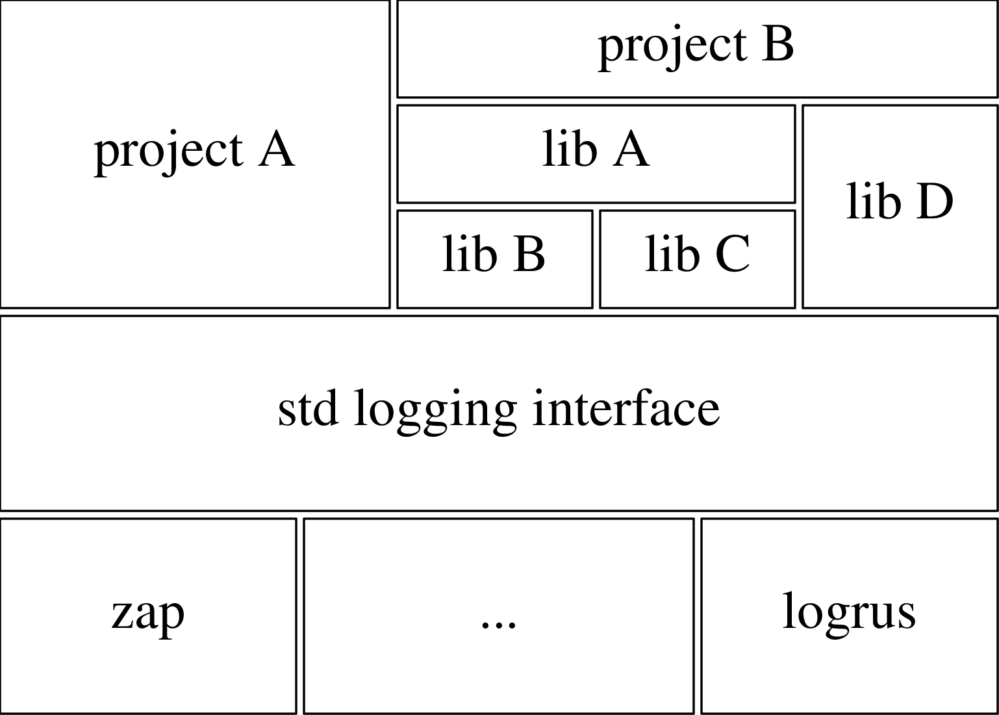

# 聊聊日志库的设计

[toc]

## 1. 前言

本文以我自己设计的一个日志库 tlog 为引子，和大家探讨一下 go 日志库的设计。

tlog 是 team log 的简写，之所以如此取名，是因为设计这个日志库的初衷是为了解决跨团队合作打日志的问题，顺便再解决一些我平时在打日志时遇到的痛点问题。

## 2. 初衷

本人在工作之余，也喜欢自娱自乐写一些代码，如 [zerone](https://github.com/ironzhang/zerone)(一个 GO RPC 框架)，我在写这些代码的时候，经常纠结一个问题：**我应该用什么日志库来输出日志**。

当前 Go 生态下有不少如 zap、logrus 这样优秀的日志库，但作为一个通用库和框架库的作者，我不希望去做日志库的选型（这是工程库的作者该考虑的），因此一些知名的开源库如 echo、gorm 都是使用一个 Logger 接口来打日志，并提供一个简易的默认实现，上层在需要时，可以提供一个新的实现来替换这个默认实现。

问题看似解决了，但我们设想一下这样两个场景：

**场景1**

我是一个工程库作者，我使用了 echo、gorm 等多个开源库，我需要为每个开源库都做一下接口适配（每个开源库定义的 Logger 接口都不一样）

**场景2**

我是一个通用库作者，我实现了好几个不同领域不同功能的通用库，我需要为每一个库都定义一个 Logger 接口吗？

要解决上述场景的痛点，有两条技术路线可以选择：

**路线1**

大家都约定使用同一种日志库，但这事除了 Go 官方强推有可能成功，其他人做这事基本没戏，但官方日志库又特别不争气，连个日志分级都没有，导致现在基本没什么人使用官方日志库。

**路线2**

所有通用库作者约定一个**公共的**、**通用的**日志接口，统一使用这个日志接口输出日志。虽然让所有通用库作者约定一个日志接口这事也很困难，但只要定义的日志接口足够通用，就有可能被广泛地认可，形成**事实上的标准**。

但现实是，现在 Go 生态圈里的大多数日志库，都没有试图去定义一个公共的、通用的日志接口。Go 社区的主流观点认为日志应该是一个**对象**，而不是一个**接口**。从日志库实现者的角度看，这个观点没什么问题，但在如今开源组件库大行其道，大公司跨部门合作比比皆是的背景下，更理想的设计是将日志输出操作抽象为接口，通过接口让使用者可以将日志输出和实际日志库选型解耦（Java 不就是这么做的么）。



## 3. 正文

本着别人不做我来做的精神，我决定自己设计一个通用日志接口，并提供一个默认实现。

### 3.1. tlog 的接口设计

在动工之前，我需要先考虑清楚两个问题：

1. **通用日志接口应该长什么样**
2. **除了上述问题外，还有哪些日志痛点问题亟需解决**

其实接口如何设计，很大程度上取决于需求，因此考虑清楚问题2，那问题1的答案基本也就明朗了，而对问题2，我认为一个通用日志库应该支持以下特性：

1. 支持日志分级
2. 支持结构化日志
3. 支持二次封装
4. 支持输出上下文信息
5. 支持日志分类
6. 以函数方式提供接口，而不是对象

下文将详细阐述上述6点需求。

**需求1** 支持日志分级

日志分级是日志的基本需求，综合参考各个日志库，tlog 将日志级别从低到高分为：

* DEBUG
* INFO
* WARN
* ERROR
* PANIC
* FATAL

6个级别，由此第一个版本的日志接口新鲜出炉：

```go
// Logger 日志接口
type Logger interface {
	Debug(args ...interface{})
	Debugf(format string, args ...interface{})

	Info(args ...interface{})
	Infof(format string, args ...interface{})

	Warn(args ...interface{})
	Warnf(format string, args ...interface{})

	Error(args ...interface{})
	Errorf(format string, args ...interface{})

	Panic(args ...interface{})
	Panicf(format string, args ...interface{})

	Fatal(args ...interface{})
	Fatalf(format string, args ...interface{})
}
```

**需求2** 支持结构化日志

随着越来越多的场合用到日志分析技术，结构化日志会成为今后的主流，因此有必要在接口层面就考虑好如何支持结构化日志。

现在的结构化日志，开发者为了追求性能，在使用的便利性方面做了妥协，如 logrus

```go
log.WithFields(log.Fields{
	"animal": "walrus",
}).Info("A walrus appears")
```

或者 zap

```go
logger.Info("failed to fetch URL",
  zap.String("url", url),
  zap.Int("attempt", 3),
  zap.Duration("backoff", time.Second),
)
```

这些方法使用起来都不是特别方便，与大部分开发者的开发习惯也大相径庭，而 tlog 的目标是统一日志接口，**方便易用**是最重要的，因此 tlog 最终采用了 zap 的 sugar 模式这种方式来支持结构化日志，于是 Logger 接口中又增加了如下方法：

```go
// Logger 日志接口
type Logger interface {
	WithArgs(args ...interface{}) Logger
	Debugw(message string, kvs ...interface{})
	Infow(message string, kvs ...interface{})
	Warnw(message string, kvs ...interface{})
	Errorw(message string, kvs ...interface{})
	Panicw(message string, kvs ...interface{})
	Fatalw(message string, kvs ...interface{})
}
```

**需求3** 支持二次封装

许多场景下，开发者有自己封装日志库的需求，这种情况下，开发者就需要自己指定调用方层级（否则日志文件中记录的文件和行号会不对），因此又增加了如下方法：

```go
// Logger 日志接口
type Logger interface {
	Print(depth int, level Level, args ...interface{})
	Printf(depth int, level Level, format string, args ...interface{})
	Printw(depth int, level Level, message string, kvs ...interface{})
}
```

**需求4** 支持输出上下文信息

后端开发中，在日志中输出 trace 等上下文信息，是最基本的需求。Go 语言的推荐做法是把这些信息放在 context.Context 结构中，直观的设计是在 Dubugf 等方法中加入 context 参数，如

```go
type Logger interface {
	Debugf(ctx context.Context, format string, args ...interface{})
}
```

但这会影响不需要输出上下文的开发者的使用体验，而且也违反了大部分程序员的使用习惯。

如果再增加 ContextDebugf 一系列的方法，如

```go
type Logger interface {
	ContextDebugf(ctx context.Context, format string, args ...interface{})
}
```

又会导致日志接口的方法数量急剧膨胀，让日志接口的实现和适配成本变高。

最终，tlog 引入了 WithContext 方法：

```go
type Logger interface {
	WithContext(ctx context.Context) Logger
}
```

使用方式如下

```go
// 不需要在日志中输出上下文信息
tlog.Debugf("debug message")

// 需要在日志中输出上下文信息
tlog.WithContext(ctx).Debugf("debug message")
```

> tlog 如何从 context 中获取上下文信息，以及不同工程需要获取的上下文字段是不同的，如何支持定制化，这些与日志输出操作无关，是实现层面的问题，不需要在接口层面考虑。下文 tlog 默认实现这一节会介绍默认实现是如何处理上述问题的。

**需求5** 支持日志分类

某些场景下，我们希望将某一类日志独立出来，不要和其他日志混杂在一起，最典型的场景就是 Access 日志。对这类需求，不好再增加 Accessf 这样的方法，因为 Access 日志是一种日志类型，而不是日志级别，而且 Access 日志只是这类需求的一种场景，我们不可能对每种场景都添加一个新方法。为支持这类需求，tlog 引入了 Named 方法：

```go
// Logger 日志接口
type Logger interface {
	Named(name string) Logger
}
```

通过命名标记日志的分类

```go
tlog.Named("access.in").Infof("http server request: %s", reqBody)
```

> 如何实现日志分类，是实现层的事，接口层只负责提供命名接口，让开发者有标记日志分类的能力。

**需求6** 以函数方式提供接口，而不是对象

综上，tlog 设计了一个通用日志接口

```go
// Logger 日志接口
type Logger interface {
	Named(name string) Logger
	WithArgs(args ...interface{}) Logger
	WithContext(ctx context.Context) Logger

	Debug(args ...interface{})
	Debugf(format string, args ...interface{})
	Debugw(message string, kvs ...interface{})

	Info(args ...interface{})
	Infof(format string, args ...interface{})
	Infow(message string, kvs ...interface{})

	Warn(args ...interface{})
	Warnf(format string, args ...interface{})
	Warnw(message string, kvs ...interface{})

	Error(args ...interface{})
	Errorf(format string, args ...interface{})
	Errorw(message string, kvs ...interface{})

	Panic(args ...interface{})
	Panicf(format string, args ...interface{})
	Panicw(message string, kvs ...interface{})

	Fatal(args ...interface{})
	Fatalf(format string, args ...interface{})
	Fatalw(message string, kvs ...interface{})

	Print(depth int, level Level, args ...interface{})
	Printf(depth int, level Level, format string, args ...interface{})
	Printw(depth int, level Level, message string, kvs ...interface{})
}
```

但如果以对象的方式提供接口，开发者输出日志时，还需要持有 Logger 接口对象，这对开发者来说是非常不便的，如

```
func FuncA(logger tlog.Logger) {
	logger.Info("start FuncA")
	...
	FuncB(logger, a, b, c)
}
```

而且日志作为软件的基础设施，是不应该影响代码设计的。为了让开发者可以更方便地输出日志，tlog 将 Logger 接口封装成了函数，以函数的形式供外部使用

```go
package tlog

func GetLogger() Logger
func SetLogger(l Logger) (old Logger)

func Named(name string) Logger
func WithArgs(args ...interface{}) Logger
func WithContext(ctx context.Context) Logger

func Debug(args ...interface{})
func Debugf(format string, args ...interface{})
func Debugw(message string, kvs ...interface{})
func Info(args ...interface{})
func Infof(format string, args ...interface{})
func Infow(message string, kvs ...interface{})
func Warn(args ...interface{})
func Warnf(format string, args ...interface{})
func Warnw(message string, kvs ...interface{})
func Error(args ...interface{})
func Errorf(format string, args ...interface{})
func Errorw(message string, kvs ...interface{})
func Panic(args ...interface{})
func Panicf(format string, args ...interface{})
func Panicw(message string, kvs ...interface{})
func Fatal(args ...interface{})
func Fatalf(format string, args ...interface{})
func Fatalw(message string, kvs ...interface{})
func Print(depth int, level Level, args ...interface{})
func Printf(depth int, level Level, format string, args ...interface{})
func Printw(depth int, level Level, message string, kvs ...interface{})
```

以上就是 tlog 所有的对外接口。

> SetLogger 函数用于设置实际的日志对象，上层可通过调用该函数替换默认日志实现。

### 3.2. tlog 的默认实现

有接口，但没有实现的话，这个接口就没有任何意义。tlog 的默认实现 zaplog 是基于 zap/core 包封装的，因为 tlog 的目标不是从零开始再造一个日志库，而是为了抽象出一个能被大家广泛接受认可的通用日志接口，提供默认实现也是为这个目标服务的，而之所以选择 zap/core 包，是因为：

* zap 的高性能，即便是 zap 的 sugar 模式，从 zap 的官方文档看，其性能也是远高于其他日志库的
* 不直接使用 zap.Logger，而是直接用它的 core 包，则是因为 zap.Logger 的灵活性不足，无法满足 tlog 对灵活性的要求

一个默认实现的好坏与否，与用户的留存是强相关的，因此以下两点是默认实现需要着重考虑的：

* 简便易用
* 足够的灵活性和可扩展性

tlog 的目标决定了 tlog 注定要追求简便易用，而灵活性和可扩展性，则是考虑到 tlog 的日志接口如果希望被广泛的认可，就要尽可能让更多的开发者使用它，而使用者一多，肯定会有一些个性化的定制需求，因此需要有足够的灵活性和可扩展性，让开发者可以根据自身的需求，进行二次开发。

但这两点，在一定程度上，是有矛盾的，越是灵活和可扩展的系统，用户需要学习的知识点就越多，使用门槛就会越高，它离简单易用就会越远，所以我们需要确立一个原则来平衡这种矛盾：**越是简单或通用的需求，用户需要了解的知识点就越少，越是复杂或个性化的需求，用户需要学习的知识点就越多。**

**易用性**

基于这个原则，如果要用 tlog 输出日志到 stdout，就非常简单：

```go
func main() {
	tlog.Debug("hello, world")
}
```

不需要任何初始化操作。这种特性在单元测试或编写脚本代码这些非正式场景下，对开发者是非常友好的。

如果希望像大部分日志组件一样，将不同级别的日志输出到不同文件，并且可以从 context 中解析出 trace 信息输出到日志中，则需要在初始化时，再做一些额外工作：

```go
func ContextHook(ctx context.Context) (args []interface{}) {
	traceID, ok := ctx.Value("trace_id").(string)
	if ok {
		args = append(args, "trace_id", traceID)
	}
	return args
}

func main() {
	cfg := zaplog.NewProductionConfig()                                                        // 构造日志配置
	logger, err := zaplog.New(cfg, zaplog.SetContextHook(zaplog.ContextHookFunc(ContextHook))) // 构造日志对象
	if err != nil {
		fmt.Fprintf(os.Stderr, "new logger: %v\n", err)
		return
	}
	defer logger.Close()   // 退出程序前关闭日志对象
	tlog.SetLogger(logger) // 设置日志对象

	ctx := context.WithValue(context.Background(), "trace_id", "123456")
	tlog.WithContext(ctx).Info("hello, world") // 输出日志
}
```

如果这种默认日志文件分级不能满足需求，还有一些特定的需求，如：

* 需要日志文件分割
* Access 日志独立输出
* 非典型的日志分级输出，如 xx.log，xx.log.wf 两级

那就需要开发者进一步去研究 tlog 的配置方式。

如果开发者还有一些更定制化的需求，如将日志输出到远程机器，而非本地磁盘，就需要开发者更进一步了解 tlog 的内部实现，然后通过开发插件的方式自己实现需求。

**灵活性**

tlog 默认实现的灵活性主要体现在以下几方面：

* 可配置日志文件的分割方式（按大小/按小时/按天），而且每类文件都可单独配置
* 可配置日志级别的输出文件
* 可配置日志分类
* 可配置编码格式

配置示例：[disfv4-registry 的日志配置](https://git.xiaojukeji.com/disfv4/disfv4-registry/blob/master/conf/prod/log.toml)

**可扩展性**

tlog 充分利用了 zap/core 的良好设计，开发者可通过开发插件的形式，实现：

* 更换日志输出设备，如输出日志到消息队列
* 支持不同的日志编码格式，如支持把脉格式

### 3.3. tlog 的实践应用

**disfv4-api**

为了在工程中，更方便地使用 tlog，我们在 tapp 框架（我们的一个程序启动框架）中集成了 tlog，该框架除了负责 tlog 的初始化外，还提供了生成配置文件模板的功能：

```shell
./disfv4-api -log-config-example log.toml
```

我们通常使用上述命令，先生成一份日志配置模板，在此基础上再做一些定制化修改。

**disf-admin**

disf-admin 工程原先使用`git.xiaojukeji.com/disf/dlog.FileBackend`对象输出日志，我们在做 v4 时，引入了`kernel-api`、`commlib`这些通用库，如果这些库不使用 tlog 来输出日志，那 disf-admin 的日志管理可能会成为一个比较麻烦的事情，但现在我们只需用 disf-admin 原本的日志库封装一个 tlog 实现就可以很简单地解决这个问题。

**单元测试**

通常单元测试不需要关注日志，但如果希望在单元测试时关闭日志输出，则可在单元测试开始处执行下述代码：

```go
func TestClientGetNSInfo(t *testing.T) {
	defer tlog.SetLogger(tlog.SetLogger(nil))

	...
}
```

## 4. 总结

最后总结几点个人的心得体会：

* 接口设计是从需求中抽象而来的
* 所有的设计取舍，都是为你的目标服务的
* 以梯度的方式平衡易用性和灵活性之间的矛盾
* 开源生态 = 标准 + 实现

